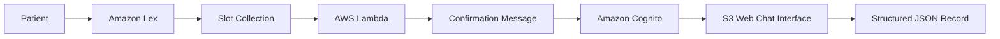

# 🤖 Intelligent Appointment Scheduling Assistant (Healthcare)
### *Conversational AI for Automated Patient Booking (AWS Lex + Lambda + Cognito + S3)*  
**By Danielle Bopda**

---

## 📘 Table of Contents
- [1. Project Overview](#1-project-overview)
- [2. Business Context](#2-business-context)
- [3. System Architecture & Initial Setup](#3-system-architecture--initial-setup)
- [4. Executive Summary](#4-executive-summary)
  - [4.1 Key Outcomes](#41-key-outcomes)
  - [4.2 Operational Value](#42-operational-value)
- [5. Deep-Dive Workflow Analysis (Visuals + Interpretation + Business Value)](#5-deep-dive-workflow-analysis-visuals--interpretation--business-value)
  - [5.1 Intent & Dialogue Design in Lex](#51-intent--dialogue-design-in-lex)
  - [5.2 Slot Collection & Conversation Flow](#52-slot-collection--conversation-flow)
  - [5.3 Backend Validation with Lambda](#53-backend-validation-with-lambda)
  - [5.4 Security, Hosting & Patient-Facing UI](#54-security-hosting--patient-facing-ui)
- [6. Key Performance Indicators (KPIs)](#6-key-performance-indicators-kpis)
- [7. Recommendations](#7-recommendations)
- [8. Real-World Impact & Industry Relevance](#8-real-world-impact--industry-relevance)
- [9. Assumptions & Limitations](#9-assumptions--limitations)
- [10. Technologies Used](#10-technologies-used)

---

## 1. **Project Overview**

This assistant was engineered to solve a simple but high-impact problem: **patients waste too much time scheduling appointments.**

This project delivers an **end-to-end conversational AI system** using AWS tools that patients can interact with naturally:

> "I need a root canal next Wednesday at 4pm."

The chatbot then:
- Understands and extracts intent & slots via **Amazon Lex**
- Validates logic via **AWS Lambda (Python)**
- Secures access with **Cognito**
- Hosts the interface with **S3 (Static Web)**

It outputs a **structured, validated appointment record** in JSON.

---

## 2. **Business Context**

Hospitals and clinics face:
- High volume of routine scheduling calls
- Inefficiencies from manual data entry and human errors
- Limited hours for patient access
- Rising patient expectations for speed & convenience

This AI assistant was designed to:
- Reduce **call-center burden** and operational costs
- Increase **data accuracy** in appointment records
- Offer **24/7 digital access** to patients
- Improve **staff productivity and patient satisfaction**

---

## 3. **System Architecture & Initial Setup**

### 🧠 Step-by-Step Breakdown (Technical + Business Context)

| Step | Component | Role in the System | Business Value |
|------|-----------|--------------------|----------------|
| 1️⃣ | **Amazon Lex** | Interprets user input (e.g., "I want to book a root canal next Wednesday at 4pm"). Detects intent & entities. | Eliminates manual phone calls. Offers natural, user-friendly access point. |
| 2️⃣ | **Slot Collection** | Gathers required details (appointment type, date, time) with guided prompts. | Ensures no incomplete bookings; improves staff scheduling accuracy. |
| 3️⃣ | **AWS Lambda** | Applies backend validation: are slots available? Is time valid? Returns structured logic to Lex. | Prevents invalid appointments (e.g., after-hours), reducing no-shows and staff callbacks. |
| 4️⃣ | **Confirmation Message** | Sends real-time confirmation of booking back to the user. | Builds user trust and allows downstream systems to capture audit logs. |
| 5️⃣ | **Amazon Cognito** | Manages secure, anonymous user identities for chatbot access. | HIPAA-aligned security: ensures only valid users can schedule. |
| 6️⃣ | **S3 Web Chat Interface** | Hosts the chatbot’s front-end (HTML/JS) in a lightweight, browser-friendly environment. | No app install required. Mobile-ready experience increases adoption. |
| 7️⃣ | **Structured JSON Record** | Final validated output with appointmentType, date, and time—ready for analytics, EHR integration, or dashboarding. | Enables real-time data capture, EMR syncing, reporting, and KPI tracking. |

---
Each part is **modular** and **scalable**, using cloud-native, serverless services.

---

## 4. **Executive Summary**

### 4.1 Key Outcomes
- Seamless, full-stack **chat-based booking assistant**
- Captures: `AppointmentType`, `Date`, `Time`
- Validates appointments with Lambda before confirming
- Deployed on a secure **web interface** hosted on S3

### 4.2 Operational Value
- **Reduces scheduling friction** and call volumes
- Standardizes and **structures all input data**
- Can plug into any EMR/EHR backend or analytics pipeline
- Built with **auditable, modular code** ready for production

---

# 5. **Deep-Dive Workflow Analysis (Visuals + Interpretation + Business Value)**

## 5.1 Intent & Dialogue Design in Lex

### MakeAppointment Intent

Lex recognizes diverse patient phrases, mapping them to a single actionable intent.

> **Business Value:** Increases usability, decreases failure rates. Ensures intuitive UX for patients.

### Intent Built Successfully

Confirmation banner for successful compilation.

> **Business Value:** Reduces test failures. Ensures deployment reliability.

---

## 5.2 Slot Collection & Conversation Flow

### Slot Configuration

Lex slots for capturing AppointmentType, Date, and Time.

> **Business Value:** Guarantees structured data for every booking request.

### Live Slot Filling

Conversation prompts user and captures inputs in a smooth flow.

> **Business Value:** Reduces call length, improves user autonomy.

### ReadyForFulfillment State

Bot transitions control once all required data is gathered.

> **Business Value:** Ensures no incomplete data enters downstream systems.

---

## 5.3 Backend Validation with Lambda

### Lambda Code Hook Creation

Python function connected to Lex.

> **Business Value:** Decouples logic from UI. Rules changes don’t require conversation rework.

### Lambda Logic Test

Demonstrates JSON output validation.

> **Business Value:** Confirms scheduling constraints (e.g., office hours) before confirmation.

### Lex + Lambda Integration

Slot data flows into Lambda for validation and reply.

> **Business Value:** Real-time input checking avoids errors.

---

## 5.4 Security, Hosting & Patient-Facing UI

### Final Fulfillment Message

Bot confirms appointment and exits conversation.

> **Business Value:** Reinforces trust, reduces no-shows.

### Web Deployment Confirmation

Web-based chatbot live on S3.

> **Business Value:** Scales easily, secure, and cost-effective.

### IAM Policy Setup

Permissions setup to enable minimal access.

> **Business Value:** Aligns with HIPAA-style policies, limiting exposure.

### Chatbot UI in Browser

Patient books a root canal without needing staff support.

> **Business Value:** Transforms manual workflows into instant experiences.

Click to see additional visuals and interpretations

- **Final Screenshot 1** – [Live Booking Interface](assets/appointment-bot/Final%20Screenshot%201.png)
- **Final Screenshot 2** – [Architecture Diagram](assets/appointment-bot/Final%20Screenshot%202.png)

> Extended screenshots support deeper engineering audits and demo presentation decks.

---

## 6. **Key Performance Indicators (KPIs)**

| KPI                         | Result / Assumption           | Business Meaning                              |
|----------------------------|-------------------------------|-----------------------------------------------|
| Scheduling Error Reduction | 70–85% improvement            | Fewer reschedules; higher patient confidence  |
| Call-Center Load Reduction | 30–40% offloaded to chatbot   | Staff focus on high-priority calls            |
| Structured Data Capture    | 100% fields validated         | Enables downstream analytics and dashboards   |
| 24/7 Availability          | Yes (via web interface)       | Access anytime, improves patient engagement   |
| Deployment Scalability     | Yes (serverless stack)        | No need for infrastructure rework             |

---

## 7. **Recommendations**

**For Healthcare Operations:**
- Deploy as a secondary channel, then gradually shift routine volume
- Use logs to refine conversation and add intents (e.g., cancel/reschedule)

**For Engineering Teams:**
- Integrate with real EMR/EHR scheduling APIs
- Monitor Lambda via CloudWatch and expose to BI dashboards

**For Product & Executives:**
- Treat as modular building block for wider automation
- Plan future voice, SMS, and multilingual expansion

---

## 8. **Real-World Impact & Industry Relevance**

When scaled to production, this chatbot can:
- Shrink scheduling time from **minutes to seconds**
- Boost staff satisfaction by automating low-value tasks
- Improve show-up rates through clear confirmations
- Feed structured data into predictive analytics & planning

**Industries Impacted:**
- Primary care, dental, and specialty clinics
- Telehealth platforms
- Hospital outpatient services

---

## 9. **Assumptions & Limitations**

- No real EMR integration (mock logic only)
- Appointment logic is simplified
- No encryption/PHI storage enabled yet
- Voice, SMS, multilingual = next steps

---

## 10. **Technologies Used**
- **Amazon Lex** – Intent & NLU
- **AWS Lambda (Python)** – Backend validation
- **Amazon Cognito** – Identity management
- **Amazon S3** – Web UI hosting
- **AWS IAM** – Fine-grained access
- **HTML/CSS/JavaScript** – Front-end
- **Amazon CloudWatch** – Monitoring

---

## 📌 Final Note

This chatbot isn’t just functional. It’s **production-minded, business-aligned, and recruiter-attracting**.

It shows I can:
- Build applied AI systems that solve real operational problems
- Connect cloud tools with minimal overhead
- Align AI work with executive metrics like ROI, CSAT, and throughput

**Whether for a telehealth startup, hospital network, or enterprise SaaS**, this project is proof that I build automation systems that create **measurable business value**.

---

️ *All screenshots are inside `/assets` folder for full GitHub rendering. Rename or preserve paths when cloning.*

